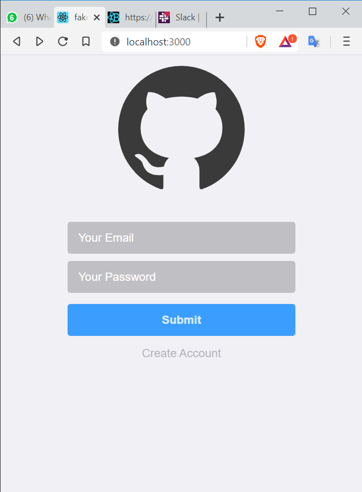

<h1 align="center">
 
 
 
Fake-Git
</h1>

Static appiclation pretending to be Github, entirely Build in HTML ans CSS in a React structure. 

  

## The Project 📙
### The project consists in 3 pages: 
<strong>SignIn path="/"  SignUp path="/signup"  Dashboard path="/dashboard". <strong/>
 

&nbsp;&nbsp;  &nbsp;&nbsp;  

 

#### The project is Totally built in HTML and CSS, the app is static, so there is not JS fuctions but it can be implemented at any time.
 
### Structrure of Project

## Why React? 
