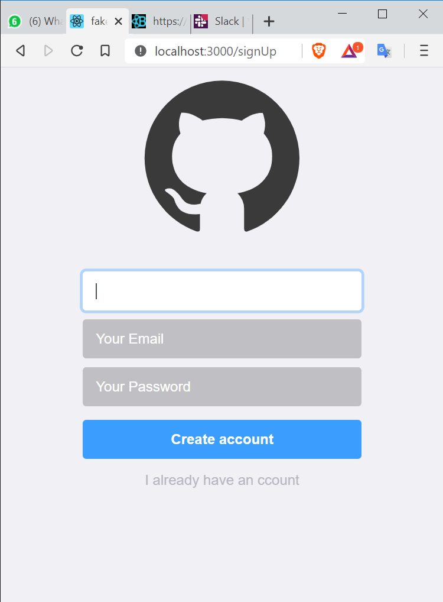
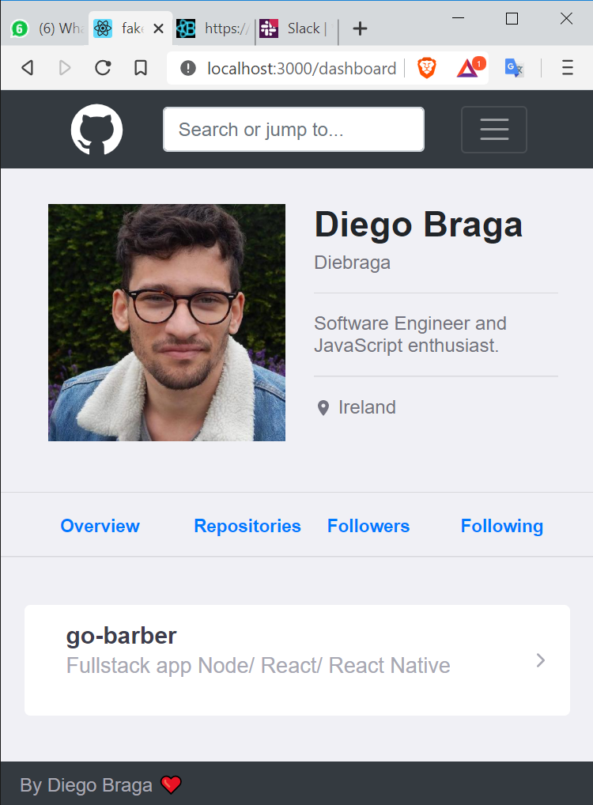

<h1 align="center">
 
 
 
Fake-Git
</h1>

Static appiclation pretending to be Github, entirely Build in HTML ans CSS in a React structure. 

  

<h2>The Features - 🎨<h2/>
<h4>HTML <h4/>
<h4>CSS <h4/>
<h4>Bootstrap <h4/>
<h4>Eslint 👌<h4/>
<h4>Prettier 💅<h4/>
  
  

## The Project 📙
  
### The project consists in 3 pages Login, Register and Profile, it has some components trying to clone Github: 
<strong>SignIn path="/"  SignUp path="/signup"  Dashboard path="/dashboard". <strong/>
 
  <h5> The project is Totally built in HTML and CSS, the app is static, so there is not JS fuctions but it can be implemented at any time.
     
The App has no validation, so you can go freely in the routes and links once running.
     
    Some Bootstrap is applied in the forms and navbar.
<h5/>
  

&nbsp;&nbsp;  &nbsp;&nbsp;  

 

   <h3>Layout responsive <h3/>
      
&nbsp;&nbsp;

 
<h3>The Structrure  🗂<h3/>
  

<strong>
  The signin, signup and dashboard directory contains:  
  Index and Styles file applied for each folder
<strong/>

<strong>
  The _components contains:  
  3 separated components and exported to dashboard layout. 
    Header, Repositorie and Footer.
<strong/>

<strong>
  The styles directory contains:  
  A global css applied to the all application
<strong/>

<strong>
  The Routes directory:  
  Defines routes inside the app.
<strong/>

## Why React? 

<h5>When your code is getting big, it gets hard to review   So separeting the code in components is better to maintain  and keep the code clean and organised<h5>
  
## Get Started.

<h4>Required*<h4/>
  <h5>* Npm or Yarn<h5/>
    <ul>
      <li>`$ git clone` This project in your local repository. 
      <li>`$ cd` The project in your editor.
      <li>Run `$ npm instal` or `$ yarn` in your terminal.
      <li>Run `$ npm instal` or `$ yarn`
      <li>Done. the project is running on your localhost.
    <ul/>
        
        
        ## License

This project is licensed under the MIT License - see the [LICENSE.md](LICENSE.md) file for details. .❤❤❤
